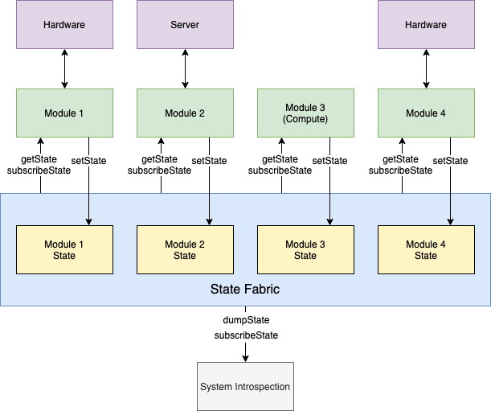

## Kasuri


## !!!!! Work-In-Progress !!!!!

An opinionated, type-safe, reactive, module state management framework designed
for complex embedded systems with a huge varity of I/O and stateful components.

Inspired by modern reactive UI frameworks and memory-driven computing.

### Concept



The system consists of a "State Fabric" and compute logic split into multiple "Modules".

Every Module has its own state that lives inside the State Fabric and could only modify its own state.

At the same time, each Module can read or subscribe to changes of all state in the whole system.

System state is managed in 2 nested levels: modules and module-state. Subscriptions listens to changes on the module-state level, although each module-state can be arbitrarily nested.

```
system: {
    module1: {
        state1: 123
    },
    module2: {
        state1: "foo",
        state2: { x:0, y:0, z:0 }
    }
}
```

### Project Structuring

The following project layout is recommended:

```
┣ index.ts      Entrypoint
┣ stateMap.ts   Exports an object mapping module name to the default state of all modules
┣ module1
┃ ┣ state.ts    Exports an object containing the default state of module1
┃ ┗ module.ts   Exports a Module class that implements module1 logic
...
```

A sample project could be found in the `test/` directory.

### API

#### `class Module`

-   `static defaultState`

```
static defaultState = {
    status: "pending",
    statusMessage: "",
}
```

Contains common default state modules. All modules' state should include these fields:

```
FooState = {
    ... Module.defaultState,
    myState: 123,
}
```

-   `getState(module: string, state: string, staleMs: number = null)`

Returns state value from the fabric given the module and state name.

Optionally discard stale values using `staleMs`, if the state is older than
`staleMs` milliseconds `getState()` returns `undefined`.

-   `subscribeState(module: string, state: string, listener: (value, oldValue) => void)`

Subscribe to state changes.

-   `stateChange(module: string, state: string): Promise`

Helper function that returns a Promise of the next state change with the new value.

-   `setState(update: Partial<ModuleState>)`

Updates the state of this module given a map of key-value pairs to set.
The `update` object a subset of the module's state.

-   `async init()`

Method to be overwritten by subclasses, this is called during system initialization.
Subclasses should set the module's `status` state in this method to `online` if it's successful.

#### `class Kasuri`

-   `constructor(stateMap, moduleMap)`:

Constructs a new system from a default state map and a module object map.
The `init()` method of each module will be called.

```
stateMap = {
    module1: {
        ...Module.defaultState,
        foo: 1,
        bar: "hello world!"
    },
    module2: {
        ...Module.defaultState,
    }
}

moduleMap = {
    module1: new Module1(),
    module2: new Module2(),
}
```

-   `store`

Global state store, contains all module state. Has the following schema:

```
{
    moduleName: {
        stateName: {
            lastUpdate: number; // unix timestamp in ms
            value: T;           // actual value of the state
        }
    }
}
```

-   `setState(module: string, update: Partial<ModuleState>)`

System-wide version of module's `setState`. (See `module.setState`)

-   `getState(module: string, state: string, staleMs: number = null)`

Same as `module.getState`.

-   `subscribeState(module: string, state: string, listener: (value, oldValue) => void)`

Same as `module.subscribeState`.

-   `stateChange(module: string, state: string): Promise`

Same as `module.stateChange`.

### Introspection

The introspection server allows you to dump, subscribe and set state in the state fabric.

```
const kasuri = new Kasuri(...);
const server = await Introspection.server({ kasuri });
```

This server is intended to be used with the CLI tool, see `$ kasuri --help` for details.
