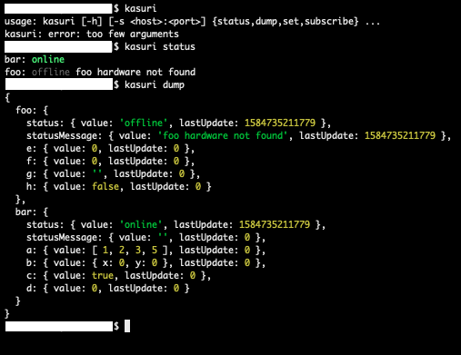

## Kasuri (絣)


[](https://www.npmjs.com/package/@akiroz/kasuri)

An opinionated, type-safe, reactive, module state management framework designed
for complex embedded systems with a huge varity of I/O and stateful components.

Inspired by modern reactive UI frameworks and memory-driven computing.

### Install

```
yarn add @akiroz/kasuri
```

### Concept


The system consists of a "State Fabric" and compute logic split into multiple "Modules".

Every Module has its own state that lives inside the State Fabric and could only modify its own state.

At the same time, each Module can read or subscribe to changes of all state in the whole system.

System state is managed in 2 nested levels: modules and module-state. Subscriptions listens to changes on the module-state level, although each module-state can be arbitrarily nested.

```
system: {
    module1: {
        state1: 123
    },
    module2: {
        state1: "foo",
        state2: { x:0, y:0, z:0 }
    }
}
```

### Motivation

This project was developed for the specific needs of complex embedded systems with dozens of hardware
integrations (e.g. sensors, actuators, network devices, displays etc...). Several existing solutions have been
evaluated / used in the past: 

- **ROS (Robot Operating System)** - A distributed computing framework written in Python/C++ designed for robots.
    Provides node discovery, pub/sub and RPC infrastructures. No predefined execution model / IO handling.
    This option was rejected because:
    
    - ROS is tied to a specific version of Ubuntu
    - Concurrency in Python/C++ is hard
    - Computation power is limited on my hardware
        
- **Erlang OTP** - The language runtime for Erlang/Elixir with built-in support for CSP concurrency, distributed node
    clustering, IO / compute scheduling, external monitoring, and a database. A solid choice for the job, however
    the diversity of 3rd-party libraries and availability of developers loses out when compared to more popular languages.

- **NodeJS + Redux** - The language runtime for Javascript with built-in support for event-based concurrency,
    IO / compute scheduling + a state management framework originally designed for UI programming with external tools for
    system introspection. NodeJS is a suitable runtime for the application, however, redux is way too complicated and
    redux-devtools often hang or crash when there's hundreds / thousands of actions per second.

Thus, Kasuri aims to be a simpler version of Redux for embedded systems.

### Note on State Mutability

It it worth noting that careful attention must be taken when using state values that aren't just simple values
(e.g. arrays, nested objects). If the state is updated via mutation of the previous state, object references will
not be updated causing the state subscription API to return the same value for both current and previous state.

In order to get correct values for the subscription API, a new object must be created if your new value depends
on the previous. The use of immutable data structures is highly recommended. [Immer][] is a good choice for creating
immutable objects from mutations of previous state.

[Immer]: https://immerjs.github.io/immer

# Project Structuring

The following project layout is recommended:

```
┣ index.ts      Entrypoint
┣ stateMap.ts   Exports an object mapping module name to the default state of all modules
┣ module1
┃ ┣ state.ts    Exports an object containing the default state of module1
┃ ┗ module.ts   Exports a Module class that implements module1 logic
...
```

A sample project could be found in the `test/` directory.

### API

#### `class Module`

-   `static defaultState`

```
static defaultState = {
    status: "pending",
    statusMessage: "",
}
```

Contains common default state modules. All modules' state should include these fields:

```
FooState = {
    ... Module.defaultState,
    myState: 123,
}
```

-   `getState(module: string, state: string, staleMs: number = null)`

Returns state value from the fabric given the module and state name.

Optionally discard stale values using `staleMs`, if the state is older than
`staleMs` milliseconds `getState()` returns `undefined`.

-   `getUpdateTime(module: string, state: string): number`

Get state last update time as unix timestamp (milliseconds)

-   `subscribeState(module: string, state: string, listener: (current, previous) => void)`

Subscribe to state changes. Listener takes both the current(new) and previous
store values, both contains state `value` and `updateTime`.

-   `stateChange(module: string, state: string): Promise<{ current, previous }>`

Helper function that returns a Promise of the next state change with the new and
previous `value` and `updateTime`.

-   `setState(update: Partial<ModuleState>)`

Updates the state of this module given a map of key-value pairs to set.
The `update` object a subset of the module's state.

-   `swapState(state: string, swapFn: ({ value, updateTime }) => newVal)`

Updates the state of this module given a state name and a swap function.
This swap function takes the state's current `value`, `updateTime` time and return its
new value.

NOTE: The swap function cannot be async.

-   `async init()`

Method to be overwritten by subclasses, this is called during system initialization.
Subclasses should set the module's `status` state in this method to `online` if it's successful.

#### `class Kasuri`

-   `constructor(stateMap, moduleMap)`:

Constructs a new system from a default state map and a module object map.
The `init()` method of each module will be called.

```
stateMap = {
    module1: {
        ...Module.defaultState,
        foo: 1,
        bar: "hello world!"
    },
    module2: {
        ...Module.defaultState,
    }
}

moduleMap = {
    module1: new Module1(),
    module2: new Module2(),
}
```

-   `store`

Global state store, contains all module state. Has the following schema:

```
{
    moduleName: {
        stateName: {
            updateTime: number; // unix timestamp in ms
            value: T;           // actual value of the state
        }
    }
}
```

-   `setState(module: string, update: Partial<ModuleState>)`

System-wide version of module's `setState`. (See `module.setState`)

-   `getState(module: string, state: string, staleMs: number = null)`

Same as `module.getState`.

-   `getUpdateTime(module: string, state: string): number`

Same as `module.getUpdateTime`.

-   `subscribeState(module: string, state: string, listener: (current, previous) => void)`

Same as `module.subscribeState`.

-   `stateChange(module: string, state: string): Promise<{ current, previous }>`

Same as `module.stateChange`.

### Introspection

The introspection server allows you to dump, subscribe and set state in the state fabric.

```
const kasuri = new Kasuri(...);
const server = await Introspection.server({ kasuri });
```

This server is intended to be used with the CLI tool, see `$ kasuri --help` for details.



#### Introspection Extensions

The introspection server supports custom extensons to read, format, and modify the state fabric.
Extension handlers can be added to the introspections server:
```
await Introspection.server({
    kasuri,
    extension: {
        myCustomExt(kasuri, reqBody: Buffer): Buffer {
            const params = JSON.parse(reqBody.toString());
            // custom logic here
        }
    },
});
```

The extension can be invoked CLI, stdin is passed as the request body and the result is piped to stdout.
```
$ echo '{"foo": 123}' | kasuri call myCustomExt
```
